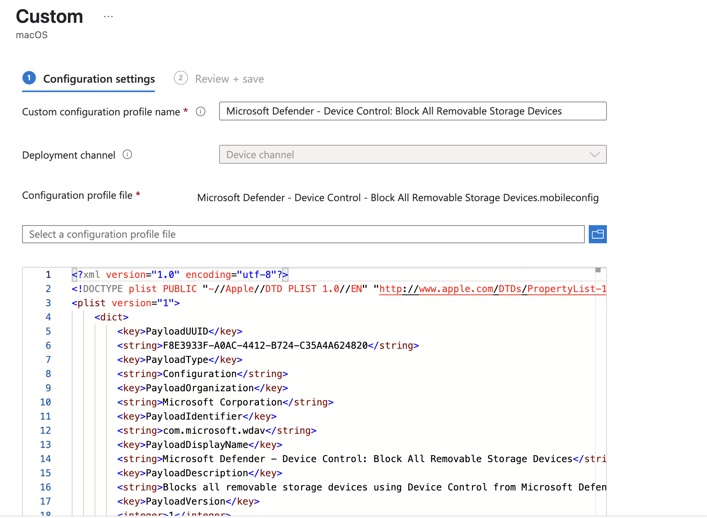

# Device Control for macOS Deployment

In this page, we have gathered some example device control policies for macOS.

## Microsoft Defender - Device Control - Block All Removable Storage Devices.mobileconfig

Ready-to-deploy example mobileconfig file to block all removable storage devices using Device Control on Microsoft Defender. This policy is following version 2 schema. This policy also enables Data Loss Prevention (DLP), that is required to device control to operate.

### Before deploying this policy, please do following ones
1. Remove placeholder URL from line 123 and add appropriate URL instead. Good example is address to your local IT Helpdesk website from your company, where employees can contact if they need more information of applied restriction.
2. Make sure, that Microsoft Defender have full disk access. [More information can be found here how that can be done](https://learn.microsoft.com/en-us/defender-endpoint/mac-device-control-overview).

> [!IMPORTANT] 
> If you have already deployed all needed policies (as ".mobileconfig" file format) to Microsoft Defender, like full disk access, via MDM, please make sure, that you have up-to-date mobileconfig policy files applied so Device Control feature will work appropriately.
>
>For example, easiest way to do the update mobileconfig policy file of full disk access is to upload available mobileconfig policy file to existing policy, that will replace older mobileconfig policy file with newer one. 
>
> Check latest mobileconfig policy files [here](https://learn.microsoft.com/en-us/defender-endpoint/mac-install-with-intune).

### Screenshot exapmple of the deployment via Intune



## demo.mobileconfig

An example mobileconfig file demonstrating how to deploy a DC policy.

### DC_in_dlp

The v2 Device Control implementation is gated behind a feature flag while in preview.  The feature will be disabled unless set in the MDE settings (com.microsoft.wdav preference domain):

```xml
    <key>dlp</key>
    <dict>
        <key>features</key>
        <dict>
            <key>name</key>
            <string>DC_in_dlp</string>
            <key>state</key>
            <string>enabled</string>
        </dict>
    </dict>
```

_Note: This will not be needed after public release._

### Device Control policy

The v2 Device Control policy is now set via the `deviceControl/policy` key.  The policy is no longer directly embedded within the MDE settings, but instead indirectly stored as a string.

```xml
    <key>deviceControl</key>
    <dict>
        <key>policy</key>
        <string>
            policy text here
        </string>
    </dict>
```

## schema.json

The [mdatp-xplat](https://github.com/microsoft/mdatp-xplat) repo's [schema.json](https://github.com/microsoft/mdatp-xplat/blob/master/macos/schema/schema.json) has been updated to expose both the `deviceControl/policy` and `dlp/features` configurations.
